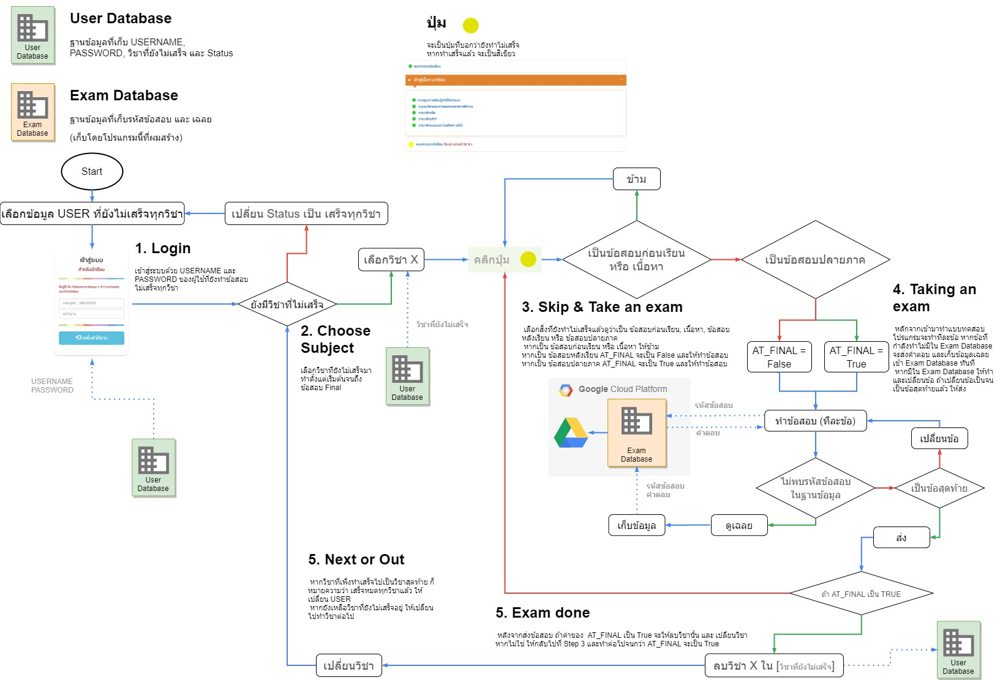
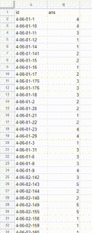

# Automation Project (Case Study)

This project has a lot of childish gibberish Python syntax. 
I'm afraid that you might puke seeing my code. Make sure to have a trash can beside you.

Also, it will be a lot less difficult if this project was created using Selenium.

Flowchart

Gathered answers

